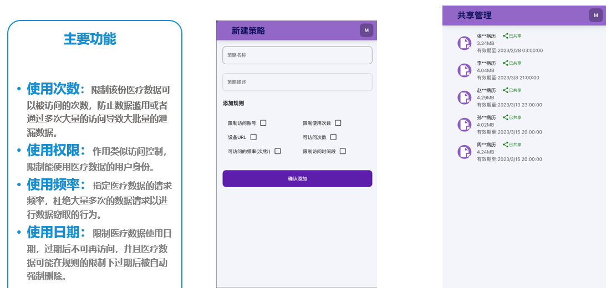

## 功能设计与实现



## 数据库设计
#### 文件表
```sql
create table files
(
    file_id   bigint unsigned auto_increment comment '病例ID 自增主键'
        primary key,
    owner_id  bigint unsigned              not null comment '拥有者用户ID',
    file_name char(100)                    not null comment '病例名称',
    file_size int unsigned                 not null comment '病例大小',
    use_count int    default 0             not null comment '文件被使用次数',
    use_limit int    default 100           not null comment '使用次数限制，管理员上传病历默认拥有100次查看机会',
    expire    bigint default 1737302400000 not null comment '过期时间，管理员上传的病历，可以指定其过期时间，默认为2025年1月'
)
    comment '共享病例表' charset = utf8;

create index owner_id
    on files (owner_id);


```
#### share_files 共享文件表
```sql
-- auto-generated definition
create table share_files
(
    id             bigint unsigned auto_increment comment '主键'
        primary key,
    fileId         bigint unsigned                    not null comment '文件ID',
    name           varchar(1000)                      not null comment '策略名称',
    des            varchar(1000)                      not null comment '策略描述',
    expire         bigint       default 1737302400000 not null comment '过期时间 默认值为当前时间增加一天',
    from_user_id   bigint unsigned                    not null comment '当前共享用户',
    target_user_id bigint unsigned                    not null comment '目标用户ID',
    use_count      int          default 0             not null comment '已使用次数',
    use_limit      int unsigned default 10            not null comment '使用次数 默认值为10'
)
    comment '分享文件表' charset = utf8;

create index idx_fileId
    on share_files (fileId);


```
#### 用户表
```sql
-- auto-generated definition
create table user
(
    user_id    bigint unsigned auto_increment comment '用户ID 自增主键'
        primary key,
    user_name  char(100)                         not null comment '用户名称',
    password   char(100)                         not null comment '用户密码',
    role_id    int unsigned default 0            not null comment '角色ID 管理员 1 普通用户 0 默认为0',
    public_key char(100)    default 'dog'        not null comment '公钥 默认为dog',
    secret_key char(100)    default 'dog_secret' not null comment '私钥 默认为dog_secret',
    constraint user_name
        unique (user_name)
)
    comment '用户表' charset = utf8;


```

## 更新项目执行流程
- 分角色
  - 管理员
    - 登录
    - 上传病例
  - 普通用户
    - 注册
    - 登录
    - 病历管理
      - 查看病历
        - 查看已共享与被共享病历
      - 共享病历
        - 创建共享策略进行共享


## 开发日志记录

11/18 ：

- 数据库表设计，完善需求分析

  - 用户表 + 用户策略表重构
- 代码处理部分进行微重构

  - 重构代码，完善异常处理
- 编写用户注册模块 + 微重构用户登录模块

  - 用户注册模块
    - 用户名唯一性校验
    - 密码加密
    - 用户注册
  - 用户登录模块微重构
    - JWT中存放加密后的用户对象，方便在后续过程中获取公钥与用户ID
    - 用户登录时，将用户对象加密后存入JWT中
    - 用户登录

11/20：

- 编写用户策略模块
  - 用户创建新策略
  - 用户删除策略
  - 用户修改策略
  - 用户分享病例时获取自身创建策略
  - 管理员查看用户策略
- 数据库表设计 + 病例管理需求分析

12/14
- 首次前后端联调，实现用户注册与登录模块，初步完善最初设计
- 增加管理员端 上传文件选项（管理员上传文件之后，用户可以进行共享以及创建相关的策略）
- 在不改变原有基础上进行扩展，不进行大幅度修改！
- 后端可以增加接口，前端尽量不要动

12/16
- 完成文件上传与预览功能，可以暂时完成系统的运行，基本框架完成构建
- 规划后续任务：病历共享，围绕基本框架进行展开

12/18
- 继续完善文件共享模块，提供查看当前已共享的文件与被共享文件
  - 完善后端接口，完善前端页面，完成基本功能
  - 修改设计缺陷，删除文件目标用户ID,删除用户策略ID，删除用户策略表，使用共享文件表
- 提供当前文件拥有者进行文件共享
  - 创建共享策略
  - 获取当前所有用户列表
  - 初步完成用户共享文件需求
- 发现新的问题
  - jwt频繁验证签名，每次请求都要进行再次查看用户登录态，比较耗费性能，后续考虑进行优化
  - 前端请求频繁导致后端无法及时响应，后续考虑引入缓存进行优化，避免频繁请求
- 新的计划
  - 明天完成查看当前用户共享病历与共享给当前用户病历，以及相关优化内容
  - 打包成apk，发给老师进行检查
  - 着手新技术，撰写毕业论文

12/19
- 业务问题
  - 用户获取文件时，如果对于同一份文件共享了不同的人，这个时候有不同的共享策略，应该怎样考虑展示？
    - 方案一，展示所有的共享内容，规定用户在进行共享时添加病历共享对象
    - 方案二，只展示文件，不区分共享用户
- 性能问题
  - 打开过多MySQL连接，导致sleep进程过多，使后面无法正常执行SQL查询
    - 解决方案：及时关闭连接
- 进度问题
  - 当前后端接口已经全部调试完成，前后端可实现联调
## TODO

**接口开发任务**

- [ ] 用户模块
  - [x] 用户表设计
  - [x] 用户注册
  - [x] 用户登录
    - [x] 使用jwt记录登录态
    - [x] 验证token作为登录条件
  - [ ] 用户密钥更新
- [ ] 病历共享模块
  - [x] 共享策略设计（共享文件表设计）
    - [x] 创建多个共享策略字段
    - [x] 关联文件，用户与策略
  - [x] 用户进行共享病历
  - [ ] 查看当前用户已共享的病历或者被共享的病历的共享策略（详情）
- [x] 病历上传模块
  - [x] 病历表设计
  - [x] 管理员进行病历上传，将病历上传至用户
  - [x] 病例二次共享