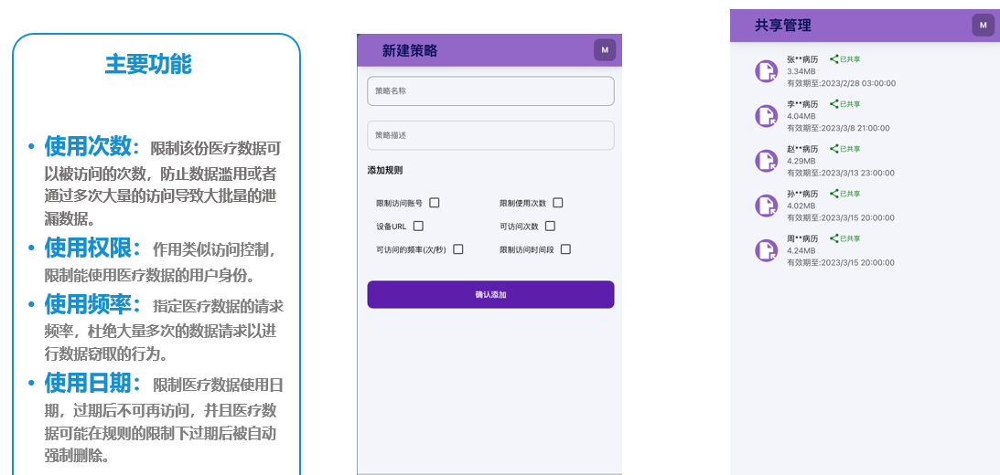

## 功能设计与实现



### 1. 策略管理

数据库设计：

```
表名：user_strategy
userId : bigint unsigned 用户ID
strategyId : bigint unsigned 策略ID 自增主键
sname  : char(100) # 策略名称
desc : varchar(200) # 策略描述 
rules : varchar(1000) 策略规则，json字符串 
is_delete : tinyint unsigned 是否删除 0 未删除 1 已删除 默认值为0
gmt_create: datetime # 创建时间 默认值为当前时间
gmt_modified : datetime # 更新时间 默认值为当前时间
```

创建表语句：

```SQL
# 创建user_strategy表并在创建语句中添加注释 并且添加默认值
CREATE TABLE `user_strategy` (
    `userId` bigint(20) unsigned NOT NULL COMMENT '用户ID',
    `strategyId` bigint(20) unsigned NOT NULL AUTO_INCREMENT COMMENT '策略ID 自增主键',
    `sname` char(100) NOT NULL COMMENT '策略名称',
    `desc` varchar(200) NOT NULL COMMENT '策略描述',
    `rules` varchar(1000) NOT NULL COMMENT '策略规则，json字符串',  
    `is_delete` tinyint(3) unsigned NOT NULL DEFAULT 0 COMMENT '是否删除 0 未删除 1 已删除',
  `gmt_create` datetime NOT NULL DEFAULT CURRENT_TIMESTAMP COMMENT '创建时间 默认当前时间',
  `gmt_modified` datetime NOT NULL DEFAULT CURRENT_TIMESTAMP COMMENT '更新时间 默认当前时间',
    PRIMARY KEY (`strategyId`),
    KEY `idx_userId` (`userId`) 
) ENGINE=InnoDB DEFAULT CHARSET=utf8 COMMENT='用户策略表';
```

策略规则描述：

```json
{
    "strategyRule": [
        # 限制访问账号
        {
            "strategyName": "limitAccount",
            "strategyDesc": "限制访问账号",
            "is_allow": 1,
            "account": ["admin"],
        },
        # 设备URL  
        {
            "strategyName": "deviceUrl",
            "strategyDesc": "设备URL",
            "is_allow": 1,
            "deviceUrl": "http://www.baidu.com"
        },  
        # 可访问的频率（次/秒）
        {
            "strategyName": "accessFrequency",
            "strategyDesc": "可访问的频率（次/秒）",
            "accessFrequency": 10,
            "is_allow": 1
        },
        # 可访问次数
        {
            "strategyName": "accessCount",
            "strategyDesc": "可访问次数",
            "accessCount": 10,
            "is_allow": 1,
        },
        # 访问时间段限制
        {
            "strategyName": "accessTime",
            "strategyDesc": "访问时间段限制",
            "accessTime": "00:00-23:59",
            "is_allow": 1
        },
        # 限制使用次数
        {
            "strategyName": "accessCountLimit",
            "strategyDesc": "限制使用次数",
            "accessCountLimit": 10,
            "is_allow": 1  
        }
    ]
}  
```

### 2. 用户管理

用户表设计

```
表名：user
user_id : bigint unsigned 用户ID 自增主键
user_name : char(100) # 用户名称
password : char(100) # 用户密码
role_id : int unsigned # 角色ID 管理员 1 普通用户 0 默认为0
public_key : char(100) # 公钥 默认为dog
secret_key : char(100) # 私钥 默认为dog_secret
is_delete : tinyint unsigned 是否注销 0 未删除 1 已删除 默认为0
gmt_create: datetime # 创建时间 默认为当前时间
gmt_modified : datetime # 更新时间 默认为当前时间
```

建表语句

```SQL
# 创建user表并在创建语句中添加注释并且添加默认值
CREATE TABLE `user` (
  `user_id` bigint unsigned NOT NULL AUTO_INCREMENT COMMENT '用户ID 自增主键',
  `user_name` char(100) NOT NULL COMMENT '用户名称',
  `password` char(100) NOT NULL COMMENT '用户密码', 
  `role_id` int unsigned NOT NULL DEFAULT 0 COMMENT '角色ID 管理员 1 普通用户 0 默认为0',
  `public_key` char(100) NOT NULL DEFAULT 'dog' COMMENT '公钥 默认为dog',
  `secret_key` char(100) NOT NULL DEFAULT 'dog_secret' COMMENT '私钥 默认为dog_secret',
  `is_delete` tinyint unsigned NOT NULL DEFAULT 0 COMMENT '是否注销 0 未删除 1 已删除 默认0',
  `gmt_create` datetime NOT NULL DEFAULT CURRENT_TIMESTAMP COMMENT '创建时间 默认当前时间',
  `gmt_modified` datetime NOT NULL DEFAULT CURRENT_TIMESTAMP COMMENT '更新时间 默认当前时间',
  PRIMARY KEY (`user_id`),
  UNIQUE KEY `user_name` (`user_name`)
) ENGINE=InnoDB DEFAULT CHARSET=utf8 COMMENT='用户表';
```

### 3.文件管理

文件表设计
```
表名：share_files
file_id : bigint unsigned 文件ID 自增主键
file_name : char(100) # 文件名称
file_size : int unsigned # 文件大小
owner_id : bigint unsigned # 拥有者用户ID 
target_user_id : bigint unsigned # 目标用户ID
use_count : int unsigned # 文件使用次数
useLimit : int unsigned # 文件使用限制次数
is_delete : tinyint unsigned 是否注销 0 未删除 1 已删除 默认为0
gmt_create: datetime # 上传时间 默认为当前时间
gmt_modified : datetime # 更新时间 默认为当前时间
```

建表语句

```SQL
# 创建share_files表并在创建语句中添加注释并且添加默认值 
CREATE TABLE `share_files`(
  `file_id` bigint unsigned NOT NULL AUTO_INCREMENT COMMENT '文件ID 自增主键',
  `file_name` char(100) NOT NULL  COMMENT '文件名称',
  `file_size` int unsigned NOT NULL COMMENT '文件大小',
  `owner_id` bigint unsigned NOT NULL  COMMENT '拥有者用户ID',
  `target_user_id` bigint unsigned NOT NULL  COMMENT '目标用户ID',
  `use_count` int unsigned NOT NULL DEFAULT 0 COMMENT '文件使用次数',
  `useLimit` int unsigned NOT NULL DEFAULT 0 COMMENT '文件使用限制次数',
  `is_delete` tinyint unsigned NOT NULL DEFAULT 0 COMMENT '是否注销 0 未删除 1 已删除 默认为0',
  `gmt_create` datetime NOT NULL DEFAULT CURRENT_TIMESTAMP COMMENT '上传时间 默认为当前时间',
  `gmt_modified` datetime NOT NULL DEFAULT CURRENT_TIMESTAMP COMMENT '更新时间 默认为当前时间',
  PRIMARY KEY (`file_id`),
  UNIQUE KEY `file_name` (`file_name`),
  KEY `owner_id` (`owner_id`),
  KEY `target_user_id` (`target_user_id`)
)ENGINE=InnoDB DEFAULT CHARSET=utf8 COMMENT='共享文件表';
```

## 开发日志记录

11/18 ：

- 数据库表设计，完善需求分析

  - 用户表 + 用户策略表重构
- 代码处理部分进行微重构

  - 重构代码，完善异常处理
- 编写用户注册模块 + 微重构用户登录模块

  - 用户注册模块
    - 用户名唯一性校验
    - 密码加密
    - 用户注册
  - 用户登录模块微重构
    - JWT中存放加密后的用户对象，方便在后续过程中获取公钥与用户ID
    - 用户登录时，将用户对象加密后存入JWT中
    - 用户登录

11/20：

- 编写用户策略模块
  - 用户创建新策略
  - 用户删除策略
  - 用户修改策略
  - 用户分享文件时获取自身创建策略
  - 管理员查看用户策略
- 数据库表设计 + 文件管理需求分析
